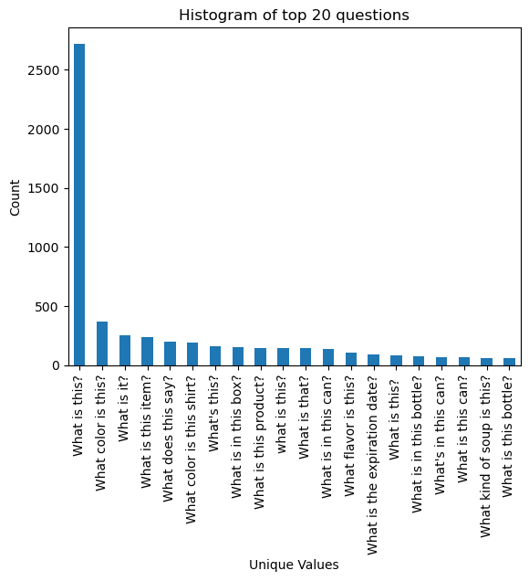
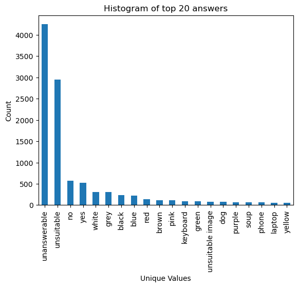
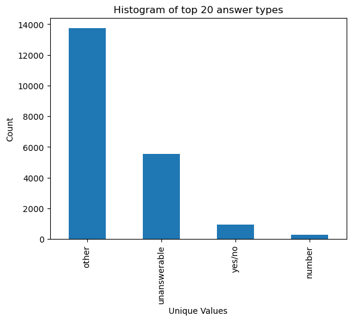
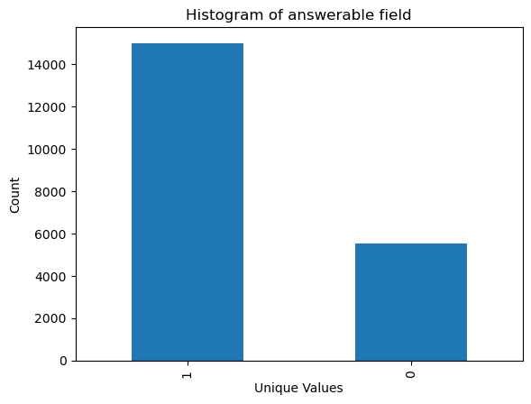
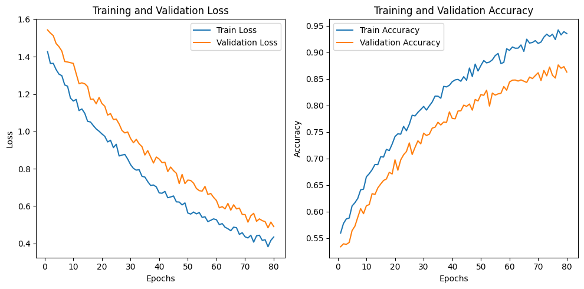
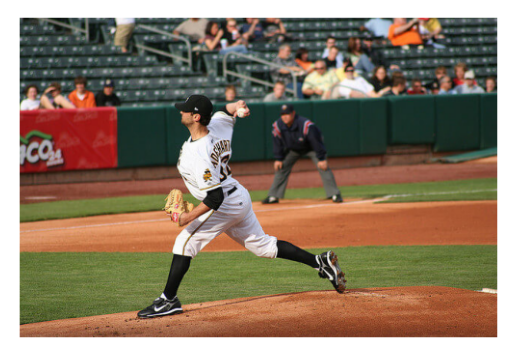
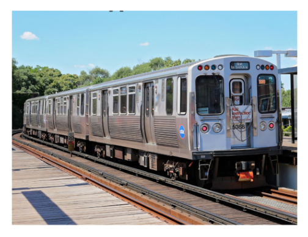

# Visual Question Answering (VQA) on VizWiz with CLIP Embeddings

This project implements an end-to-end **Visual Question Answering (VQA)** pipeline on the **VizWiz-VQA** dataset.  
Given an image and a natural-language question, the system predicts:

1. the **final answer** (multi-class classification over the answer vocabulary), and  
2. the **answer type** (one of: `other`, `unanswerable`, `yes/no`, `number`) as an auxiliary task.

The approach uses a **frozen CLIP encoder** to extract image–text representations and a lightweight **multi-task classifier** to learn answer prediction.

---

## Authors

**Amr Abdelsamee Youssef  - 7126**  
**Ahmed Ashraf Abdelkarim - 6940**  
**Hazem Mohammed Abdullah - 6723**

---

## Problem statement

Visual Question Answering (VQA) is the task of answering open-ended questions based on an image. VQA has many applications (e.g., assistive technologies, education, surveillance).  
In this project we use the **VizWiz** dataset, which was constructed to help visually impaired people.

> “we introduce the visual question answering (VQA) dataset coming from this population, which we call VizWiz-VQA. It originates from a natural visual question answering setting where blind people each took an image and recorded a spoken question about it, together with 10 crowdsourced answers per visual question.”

---

## What’s implemented

### 1) Data loading (VizWiz annotations → DataFrame)
The notebook loads the VizWiz JSON annotation files and builds a dataframe with the following fields:

- `questions`
- `answerable`
- `answer_type`
- `answers` (list of up to 10 crowd answers)
- `answer_confidence` (list of confidence labels for each answer: `yes`, `maybe`, `no`)
- `images_names`

### 2) Answer consolidation (from 10 answers → 1 label)
VizWiz provides multiple answers per question, so the project converts them into a **single training label** by:

1. **Encoding confidence**:  
   `yes → 3`, `maybe → 2`, `no → 1`

2. **Weighted majority vote** over the 10 answers (confidence-weighted)

3. **Tie-breaking**:
   - If multiple answers share the same weighted score, prefer the answer that is **more frequent globally** in the dataset.
   - If still tied, use **Levenshtein distance** as a lexical similarity heuristic to resolve ties.

This produces a single final `answers` value per sample.

---

## Exploratory data analysis (EDA)

On the training set, the notebook visualizes the distribution of questions, answers, answer types, and the `answerable` field.

Key dataset stats observed in the notebook:
- **Training set size:** 20,523 samples  
- **Validation set size:** 4,319 samples  
- **# Answer classes:** 5,247 unique answers  
- **# Answer types:** 4

<details>
<summary><b>EDA plots</b> (click to expand)</summary>

### Most common questions


### Most common answers


### Answer type distribution


### Answerable distribution


</details>

---

## Feature extraction with CLIP

Instead of training an image encoder from scratch, the project uses **OpenAI CLIP** as a frozen feature extractor:

- CLIP backbone: `ViT-L/14@336px`
- For each sample:
  - Encode the **image** into an embedding vector
  - Encode the **question text** into an embedding vector
  - **Concatenate** both vectors to form a joint representation

The computed embeddings are stored in a new dataframe column called `encoding`.

> Note: The notebook rotates images by 90° during preprocessing (`.rotate(90)`), which can help with some orientation issues commonly found in real-world VizWiz images. You may want to verify whether this is always desirable for your local copy of the dataset.

To avoid re-running CLIP encoding repeatedly, the notebook also saves the encoded dataframes to CSV:
- `data_train.csv`
- `data_val.csv`

---

## Label encoding & splits

### Label encoding
Two encoders are used:
- `answers_encoder`: encodes the consolidated answers into integer class IDs (`num_classes = 5247`)
- `answers_types_encoder`: encodes answer types into integer class IDs (`num_answers_types = 4`)

### Train / test split
The notebook splits the training data into:
- **Train:** 19,496 samples
- **Test:** 1,027 samples (5%)

The split is **stratified by** `answer_type`.

---

## Model

### Architecture
A compact multi-task neural network predicts both the answer and the answer type:

- Shared trunk:
  - `LayerNorm(input_size)`
  - `Dropout(0.5)`
  - `Linear(input_size → 512)`
  - `LayerNorm(512)`
  - `Dropout(0.5)`

- Two prediction heads:
  1. **Answer head:** `Linear(512 → num_classes)`
  2. **Answer-type head:** `Linear(512 → num_answer_types)`

- **Gated fusion**:
  - Map answer-type logits into the answer space via a linear layer + sigmoid gate
  - Element-wise gate the answer logits:
    - `gate = sigmoid(Linear(answer_type_logits))`
    - `final_answer_logits = answer_logits * gate`

This encourages the auxiliary head to provide a coarse “prior” over the answer space.

---

## Training

- **Loss:** multi-task cross entropy  
  `Loss = CE(answer_logits, answer_label) + CE(answer_type_logits, answer_type_label)`

- **Optimizer:** Adam (`lr = 1e-3`)
- **Batch size:** 32
- **Epochs:** 80
- **Metrics reported:**
  - `answer_accuracy`
  - `answer_type_accuracy`
  - `overall_accuracy = (answer_accuracy + answer_type_accuracy) / 2`

### Learning curves


---

## Results (from the notebook run)

**Test performance (5% holdout from the training split):**
- **Loss:** 0.5369  
- **Overall accuracy:** 0.8542  
- **Answer accuracy:** 0.8327  
- **Answer-type accuracy:** 0.8985  

---

## Inference examples

The notebook demonstrates inference on three external images/questions:

- Baseball image + *"what is this?"* → **player**
- Train image + *"what is the type of this vehicle?"* → **train**
- Grapes image + *"what is this?"* → **grapes**

<details>
<summary><b>Example images</b> (click to expand)</summary>

  
  


</details>

---

## How to run

### 1) Environment
Recommended: run on **GPU** (Kaggle/Colab/local CUDA).

Install dependencies used in the notebook:
```bash
pip install ftfy regex tqdm
pip install git+https://github.com/openai/CLIP.git
```

You will also need (typical installs):
- `torch`, `torchvision`
- `numpy`, `pandas`
- `matplotlib`
- `scikit-learn`
- `Pillow`

### 2) Dataset
Download the **VizWiz-VQA** dataset (images + annotations) and update paths in the notebook:
```python
JSONS_DIR = "/path/to/VizWiz/Annotations/"
IMAGES_DIR = "/path/to/VizWiz/"
```

Expected structure (as used in the notebook):
- `Annotations/train.json`
- `Annotations/val.json`
- `train/train/<image>.jpg`
- `val/val/<image>.jpg`

### 3) Run the notebook
Open `VQA.ipynb` and run cells in order:
1. Data loading & preprocessing
2. Answer consolidation
3. EDA (optional)
4. Label encoding
5. CLIP feature extraction (creates `encoding`)
6. Train / evaluate
7. Run inference examples

---

## Repository structure

```
.
├── VQA.ipynb
└── assets/                     # README images (EDA + learning curves + examples)
```

---

## Notes & known pitfalls

- **LabelEncoder consistency:**  
  For correct evaluation and inference, fit encoders on the training set **once** and then apply `.transform()` on validation/test/inference sets.  
  (Re-fitting on validation data can change the label ↔ id mapping.)

- **Answer space is large (5,247 classes):**  
  This formulation treats VQA as classification. It works well for frequent answers, but rare answers are hard to learn.

- **CLIP feature extraction speed:**  
  Encoding each sample with CLIP can be slow. Saving `data_train.csv` / `data_val.csv` helps avoid repeated encoding.

- **VizWiz data quality:**  
  Many questions are inherently unanswerable due to blurry images, missing context, etc. The auxiliary `answer_type` head helps model this.

---

## Future improvements

- Use the official VizWiz/VQA consensus scoring instead of strict class accuracy.
- Fine-tune CLIP end-to-end (or partially) for better domain adaptation.
- Replace the MLP with a stronger fusion model (e.g., transformer fusion on image tokens + text tokens).
- Normalize answers (lowercasing, punctuation stripping, spelling correction) to reduce label sparsity.
- Add a dedicated `answerable` prediction head and integrate it explicitly into the final answer selection.

---

## Acknowledgements

- VizWiz dataset creators and annotators
- OpenAI CLIP model and community implementations
